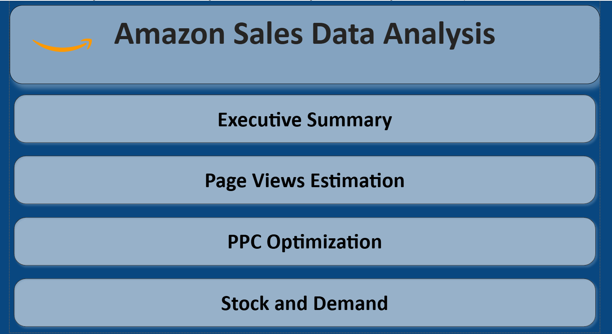
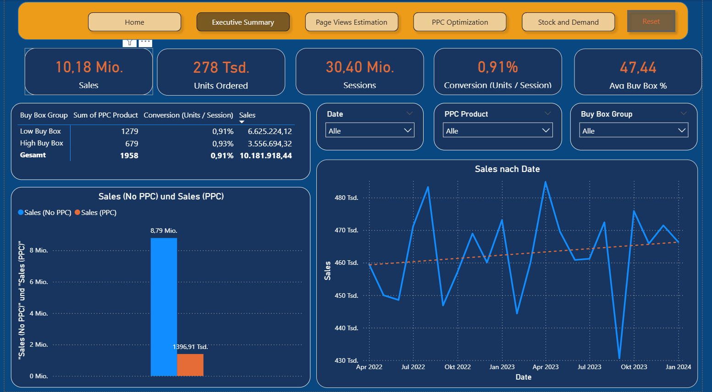

# 🚀 Amazon Sales Analytics : Optimization & Forecasting

### 🏠 Home Page (Navigation Hub)

The entry point of the dashboard is designed as a **navigation hub**, allowing users to quickly access different analytical layers of the system:

* Executive Summary
* Page Views Estimation
* PPC Optimization
* Stock & Demand

Instead of a traditional static dashboard, this structure provides a **guided analytical flow**, enabling users to move from high-level performance insights to detailed optimization and forecasting views.

👉 Focus: Creating a **structured, user-driven analytics experience**

## 📊 From Data to Decisions

Most dashboards show what happened.
This project goes one step further — it shows **what to do next**.

This is an end-to-end **Amazon analytics and decision-support system** that combines:

* Sales performance analysis
* Funnel optimization
* PPC (Advertising) efficiency
* Demand forecasting
* Stock planning

👉 The goal is not just visualization, but **data-driven decision making**.

---

## 🧠 Business Problem

E-commerce businesses often struggle with:

* Where does revenue actually come from?
* Is PPC spending profitable?
* Where do customers drop in the funnel?
* How much stock is needed next month?

This project answers these questions by connecting **marketing, sales, and operations** into one unified system.

---

## ✨ Key Features

### 📈 Executive KPI Dashboard

* Revenue, Units, Sessions, Conversion Rate
* Buy Box performance analysis
* PPC vs Organic sales comparison

---

### 🔍 Funnel & Performance Analysis

* Page Views → Sessions → Orders tracking
* Funnel drop-off detection
* Efficiency scoring system

---

### 💰 PPC Optimization Engine

* ROAS, ACOS, CPC tracking
* Campaign segmentation (STOP / TEST / SCALE logic)
* Budget optimization insights

---

### 📊 Forecasting & Demand Planning

* Page View prediction
* Units forecasting
* Reorder point & safety stock calculation

---

## ⚙️ Architecture / How It Works

1. **Data Collection**

   * Amazon Business Reports
   * PPC Campaign Data
   * Search Term Data

2. **Data Transformation**

   * Data cleaning & preprocessing
   * Feature engineering (conversion, segments, ratios)

3. **Data Modeling**

   * Star schema (Fact & Dimension tables)
   * Time intelligence via Date dimension

4. **Analytics Layer (DAX)**

   * KPI calculations (Conversion, ROAS, ACOS)
   * Funnel metrics
   * Forecast integration

5. **Visualization Layer**

   * Interactive Power BI dashboard
   * Multi-page navigation (Executive, PPC, Forecast, Stock)

---

## 📸 Dashboard Preview

---

## 🎯 Project Scope

This project is part of a structured multi-sprint Amazon analytics series:

* Sprint 2 → Data Preparation, Cleaning & Exploratory Data Analysis (EDA)
* Sprint 3 → Revenue, Profitability & Churn Analysis
* Sprint 4 → Optimization, Forecasting & Decision Support Systems

---

## 🛠️ Tech Stack

* 📊 Power BI
* 🧮 DAX
* 🐍 Python
* 🗄️ SQL
* 📁 Excel / CSV

---

## ▶️ Usage

1. Download the repository
2. Open the `.pbix` file using Power BI Desktop
3. Explore the dashboard pages:

   * Executive Summary
   * Page Views Estimation
   * PPC Optimization
   * Stock & Demand

---

## 🚧 Challenges & Learnings

* Transforming fragmented datasets into a unified model
* Designing meaningful KPIs instead of vanity metrics
* Connecting PPC performance with real business outcomes
* Integrating forecasting into BI dashboards
* Shifting from reporting → decision-driven analytics

---

## 📈 Key Takeaway

👉 Data alone does not create value.
👉 Value is created when data is translated into decisions.

---

## ⚠️ Data Disclaimer

Due to data privacy and confidentiality reasons,
the dataset used in this project has been **modified, anonymized, and partially synthesized**.

The structure, relationships, and analytical logic are preserved to reflect real-world scenarios.

---

## 🔗 Connect

* LinkedIn: https://www.linkedin.com/in/mesut-karagöz-181733260/
* GitHub: https://github.com/Mst-KrgZ
